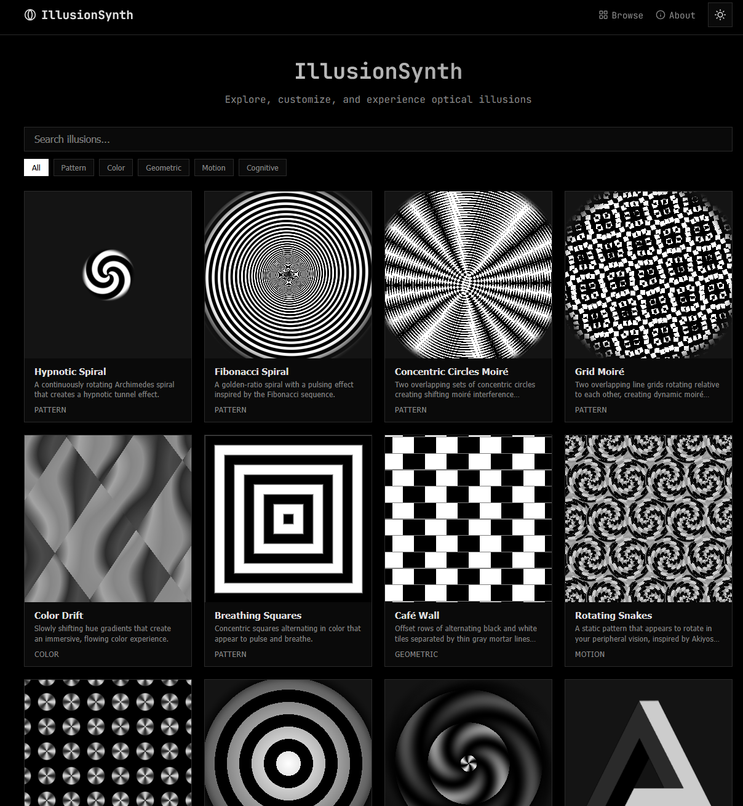
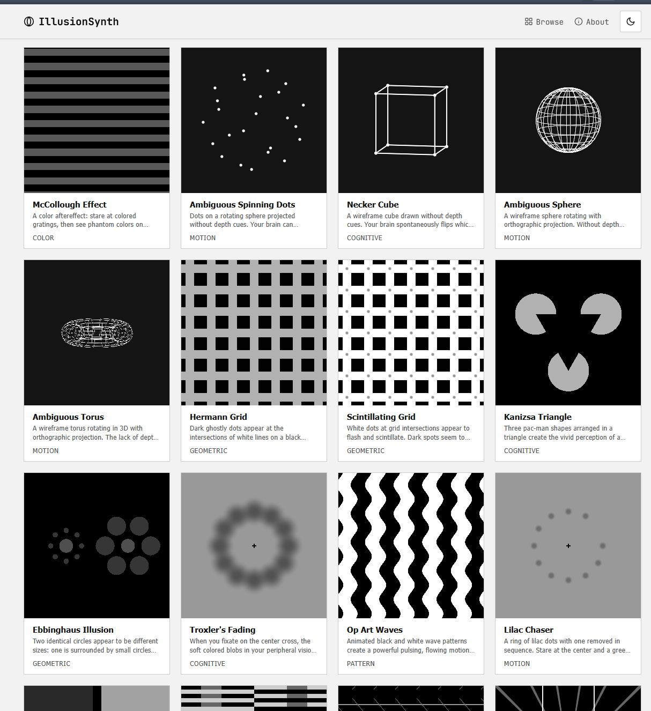
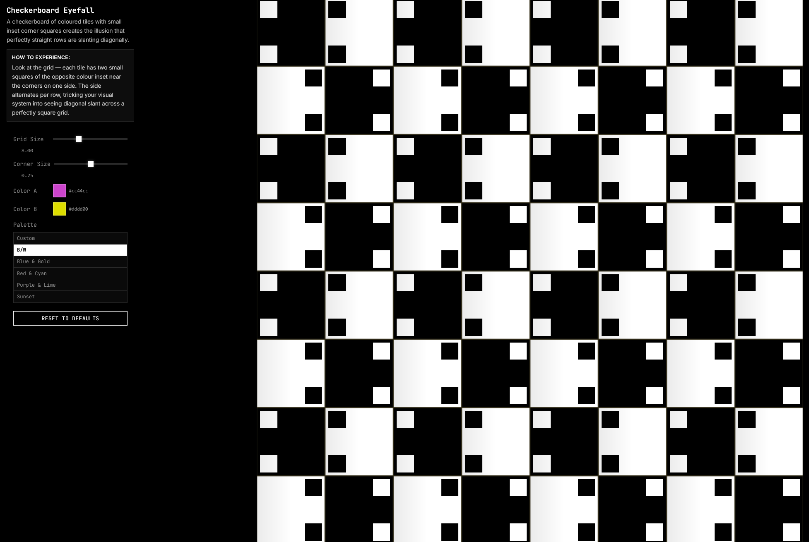
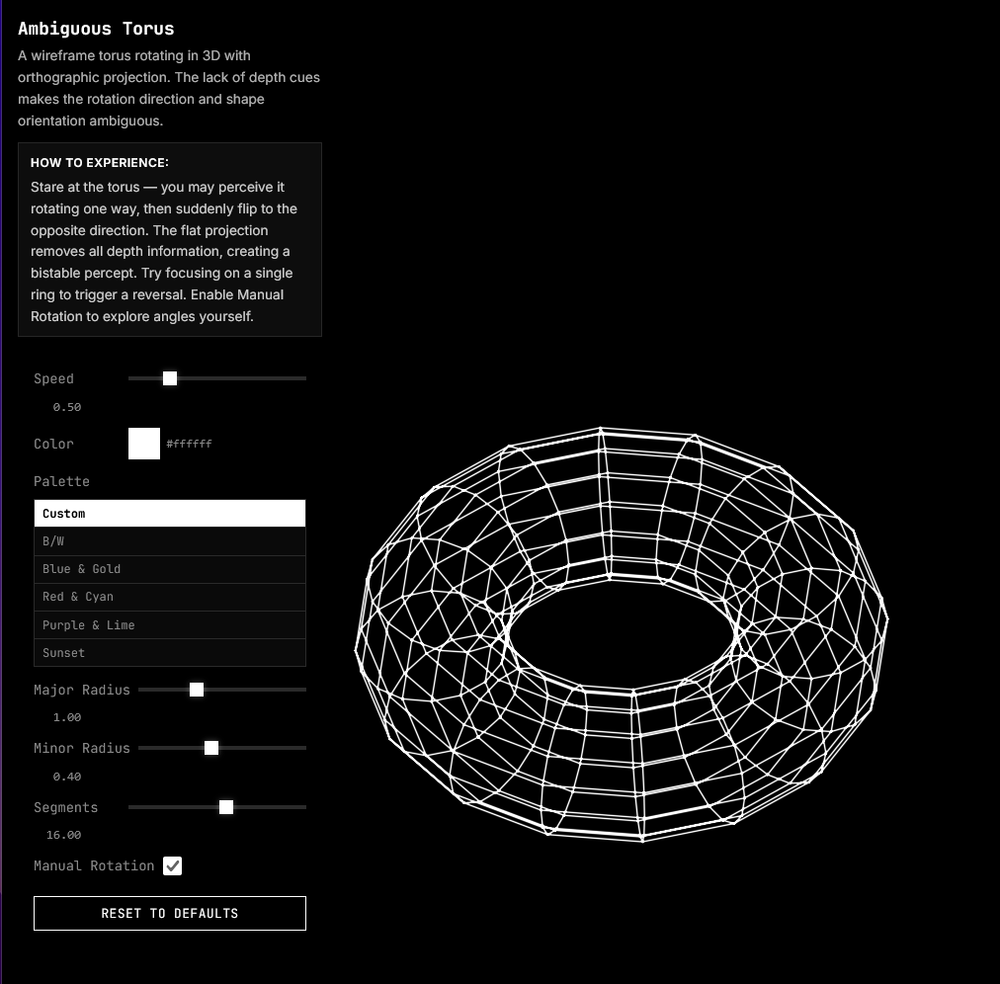
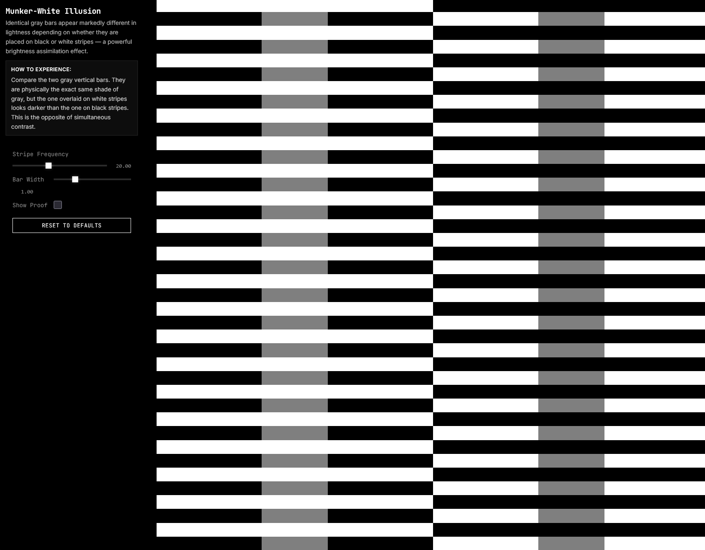
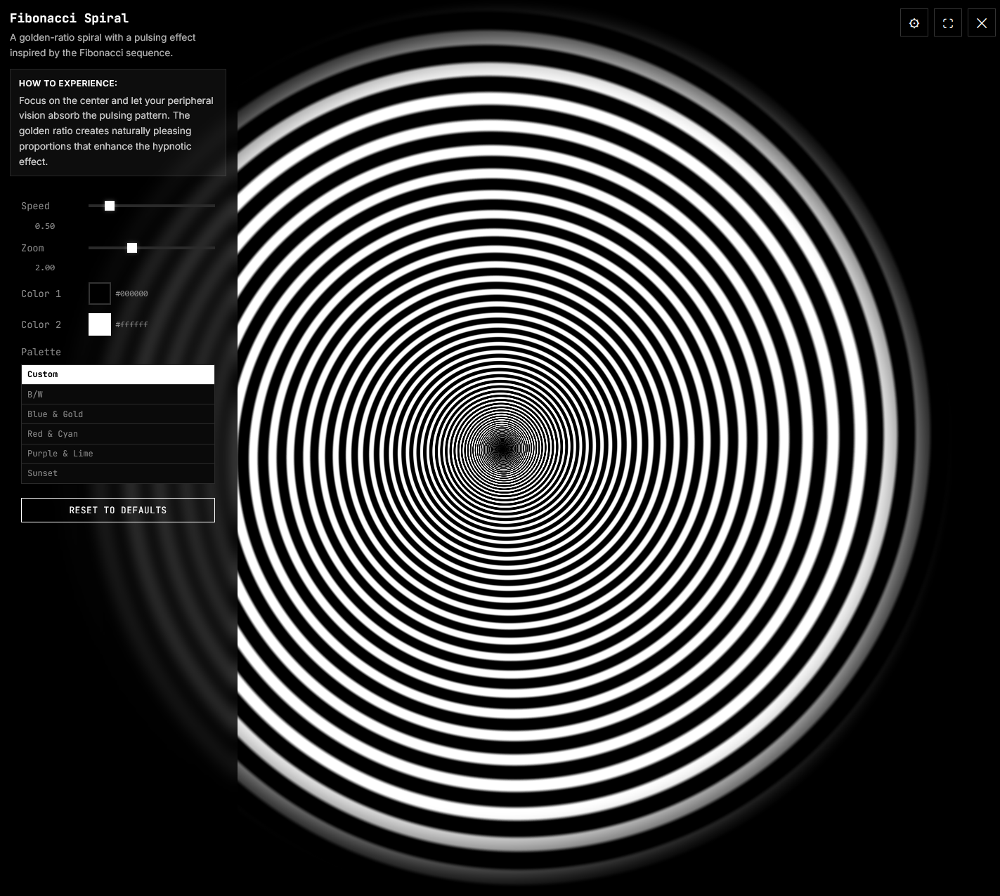

# 🌀 Illusion Synth

**An interactive optical illusion generator — real-time WebGL visuals you can customize and share.**

## About

**IllusionSynth** is an interactive optical illusion generator that renders mesmerizing visual patterns in real-time using WebGL. Browse a curated collection of 40+ illusions — from hypnotic spirals and moiré patterns to impossible shapes and infinite tunnels — and customize them with intuitive controls.

### Illusion Categories

- **Spirals** — Rotating and pulsing spiral patterns
- **Moiré** — Overlapping patterns creating interference effects
- **Color** — Afterimage and color drift illusions
- **Op-Art** — Geometric patterns that appear to move
- **Motion** — Static patterns with apparent motion
- **Tunnel** — Depth and vortex effects
- **Impossible** — Paradoxical 3D geometry

### Features

- **Real-time rendering** — All illusions are GPU-accelerated via WebGL shaders
- **Customizable parameters** — Adjust speed, colors, scale, direction, and more
- **Fullscreen mode** — Immerse yourself in the visual experience
- **Shareable links** — Share your custom illusion settings via URL
- **Dark & light themes** — Switch to match your preference
- **Responsive design** — Works on desktop and mobile

Fully client-side. No backend. No database. Deploys as a static site.

## Screenshots

|  |  |
| ------------------------------------------------------------- | ------------------------------------------------------------- |
|  |  |
|  |  |
